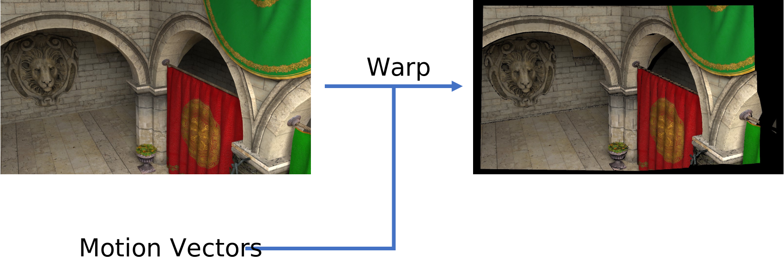

# Image-Warp-PyTorch
This is a customized PyTorch operation for replacement of nn.functional.grid_sample(). Warping (a.k.a. reprojecting) is an essential step in Temporal Anti-aliasing, Real-time Path Tracing Denoising, etc. It can morph the image according to the motion vectors (a.k.a. optical flows) to align it with another image.



## Usage
> image_warp.apply(*image, motion_vector*)

Warp the input ***image*** with size {*N, C, H, W*} according to the ***motion vector*** with size {*N, H, W, 2*}. 

> image_warp_accum.apply(*image_src, image_dst, motion_vector, alpha*)

Warp the ***image_src*** and blend it with the ***image_dst***. The ***motion_vector*** maps the target image to the source image.

Letting ***I<sub>src</sub>*** denote ***image_src***, ***I<sub>dst</sub>*** denote ***image_dst***, ***α*** denote ***alpha***, **V** denote ***motion_vector***, and ***I<sub>out</sub>*** denote returning value, this function can be defined as:


## Compile
```bash
bash ./install_kernel_filter.sh
```

## Difference between torch.nn.functional.grid_sample()
The input ***motion_vector*** stores coordinates in a relative manner. E.g., a motion vector of (-5, 8) will move the pixel at (x, y) to the new location at (x-5, y+8). On the other hand, the input ***grid*** of [torch.nn.functional.grid_sample()](https://pytorch.org/docs/1.11/generated/torch.nn.functional.grid_sample.html?highlight=grid_sample#torch.nn.functional.grid_sample) stores coordinates in an absolute manner. 

The inference speed is a bit faster than torch.nn.functional.grid_sample().
